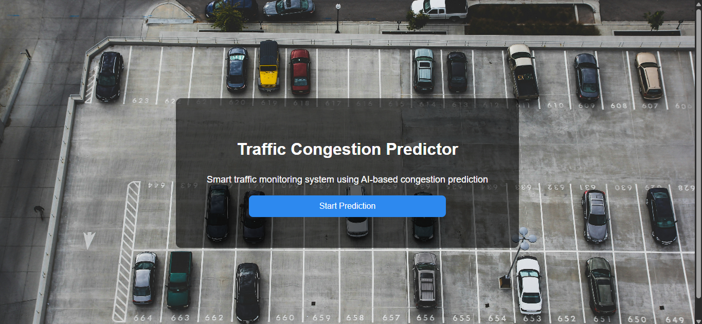
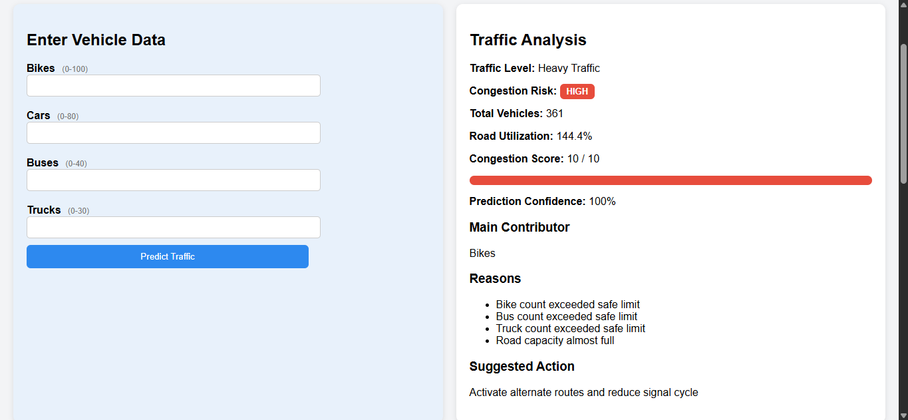
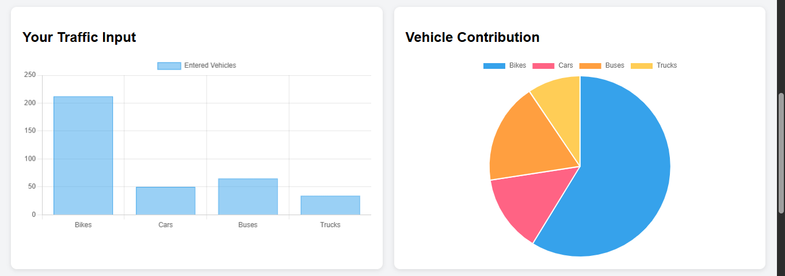
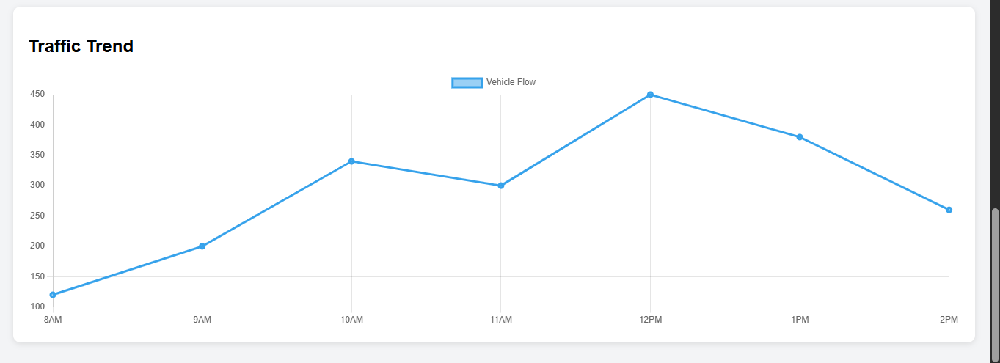

# Traffic Congestion Predictor 🚦

An AI-based traffic monitoring system that predicts road congestion using vehicle count data.
The system analyzes traffic inputs (bikes, cars, buses, trucks) and provides congestion analysis with visual dashboards.

Built using **Python, Flask, HTML, CSS, and Chart.js**.

---

## Features

* Predicts traffic congestion levels
* Classifies congestion as **LOW / MEDIUM / HIGH**
* Shows road utilization and congestion score
* Identifies the main vehicle contributing to congestion
* Provides suggested traffic management actions
* Interactive traffic trend visualization
* Vehicle contribution pie chart
* Clean dashboard-style UI

---

## System Workflow

1. User enters vehicle counts (Bikes, Cars, Buses, Trucks)
2. AI prediction logic evaluates congestion
3. System calculates:

   * Total vehicles
   * Road utilization
   * Congestion score
4. Dashboard displays:

   * Traffic analysis
   * Risk level
   * Vehicle contribution chart
   * Traffic trend graph

---

## Technologies Used

| Technology | Purpose            |
| ---------- | ------------------ |
| Python     | Backend logic      |
| Flask      | Web framework      |
| HTML/CSS   | Frontend interface |
| Chart.js   | Data visualization |
| JavaScript | Interactive charts |

---

## Project Structure

```
traffic_ai_project/
│
├── app.py
├── predictor.py
│
├── templates/
│   ├── index.html
│   └── predictor.html
│
├── static/
│   ├── style.css
│
├── screenshots/
│   ├── homepage.png
│   ├── dashboard.png
│   ├── vehicle_chart.png
│   └── traffic_trend.png
│
└── README.md
```

---

## Installation

Clone the repository

```
git clone https://github.com/your-username/traffic-congestion-predictor.git
```

Navigate to the project folder

```
cd traffic-congestion-predictor
```

Install dependencies

```
pip install flask
```

Run the application

```
python app.py
```

Open your browser and go to

```
http://127.0.0.1:5000/
```

---

## Screenshots

### Home Page

Traffic background landing page with navigation to the predictor dashboard.



### Traffic Prediction Dashboard

Vehicle input interface with AI-based congestion analysis.



### Vehicle Contribution Chart

Pie chart showing how different vehicle types contribute to congestion.



### Traffic Trend Visualization

Line graph displaying traffic trends over time.



---

## Future Improvements

* Integration with real-time traffic datasets
* Google Maps API integration
* Camera-based vehicle detection
* Machine learning model trained on real traffic data
* Smart traffic signal control system

---

## Author

Disha Chavan
B.Tech Computer Science Student

---

## License

This project is developed for educational and academic purposes.
